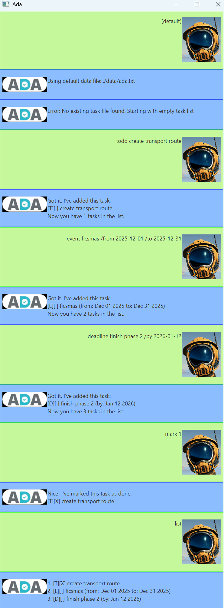

# Ada User Guide

Ada is a task management chatbot that helps you keep track of your tasks, deadlines, and events. Simply type commands to manage your to-do list with ease!



## Features

### Choose your save file
Input your own save file at the start of the program, or press enter to use the default save file: `./data/ada.txt`

Invalid inputs of save files to result in use of default save file.

**Warning: Save files whose input cannot be parsed will be overwritten on first modification task**

### Adding a To-Do Task

Add a simple to-do task to your list.

**Format:** `todo <description>`

**Example:**
```
todo Read a book
```

**Expected output:**
```
Got it. I've added this task:
[ ] Read a book
Now you have 1 task in the list.
```

### Adding a Deadline

Add a task with a specific deadline.

**Format:** `deadline <description> /by <time>`

Support date/time formats:
- `yyyy-MM-dd HH:mm` (e.g., 2026-02-20 18:00)
- `dd/MM/yyyy HH:mm` (e.g., 20/02/2026 18:00)
- `dd-MM-yyyy HH:mm` (e.g., 20-02-2026 18:00)
- `yyyy-MM-dd` (date only, treated as midnight)

**Example:**
```
deadline Submit report /by 2026-02-28 23:59
```

**Expected output:**
```
Got it. I've added this task:
[ ] Submit report (by: Feb 28 2026)
Now you have 2 tasks in the list.
```

### Adding an Event

Add an event with a start and end time.

**Format:** `event <description> /from <start time> /to <end time>`

**Example:**
```
event Team meeting /from 2026-02-21 14:00 /to 2026-02-21 15:30
```

**Expected output:**
```
Got it. I've added this task:
[ ] Team meeting (from: Feb 21 2026 2:00 PM to: Feb 21 2026 3:30 PM)
Now you have 3 tasks in the list.
```

### Viewing Your Tasks

Display all tasks in your list.

**Format:** `list`

**Example:**
```
list
```

**Expected output:**
```
Here are the tasks in your list:
1. [ ] Read a book
2. [ ] Submit report (by: Feb 28 2026)
3. [ ] Team meeting (from: Feb 21 2026 2:00 PM to: Feb 21 2026 3:30 PM)
```

### Marking a Task as Done

Mark a task as complete.

**Format:** `mark <task index>`

**Example:**
```
mark 1
```

**Expected output:**
```
Nice! I've marked this task as done:
[X] Read a book
```

### Unmarking a Task

Mark a completed task as not done.

**Format:** `unmark <task index>`

**Example:**
```
unmark 1
```

**Expected output:**
```
OK, I've marked this task as not done yet:
[ ] Read a book
```

### Deleting a Task

Remove a task from your list.

**Format:** `delete <task index>`

**Example:**
```
delete 2
```

**Expected output:**
```
Noted. I've removed this task:
[ ] Submit report (by: Feb 28 2026)
Now you have 2 tasks in the list.
```

### Finding Tasks

Search for tasks by keywords.

**Format:** `find <keyword1> <keyword2> ...`

**Example:**
```
find book meeting
```

**Expected output:**
```
Here are the matching tasks in your list:
1. [ ] Read a book
2. [ ] Team meeting (from: Feb 21 2026 2:00 PM to: Feb 21 2026 3:30 PM)
```

### Exiting the Application

Close Ada.

**Format:** `bye`

**Example:**
```
bye
```

**Expected output:**
```
Bye. Hope to see you again soon!
```

## Tips

- Task indices start from 1, not 0
- All tasks are automatically saved to disk
- Date and time formats are flexible - choose the format that works best for you
- Use the `find` command with multiple keywords to search for related tasks